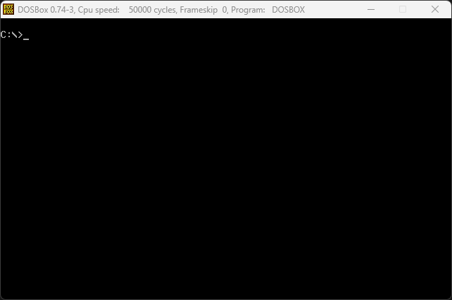

# MS DOS Cursor Size


<p align="center">
  
</p>


> Set the Microsoft DOS cursor to a block cursor. █


## 📑 Contents

- [🔎 Overview](#-overview)
- [✨ Features](#-features)
- [🚀 Quick Start](#-quick-start)
- [⌨️ Usage](#-usage)
- [⚙️ How It Works](#-how-it-works)
- [📂 Project Structure](#-project-structure)
- [💻 Building From Source](#-building-from-source)
- [🙋‍♂️ Acknowledgements](#-acknowledgements)
- [📄 License](#-license)


## 🔎 Overview

**cursor** is an **MS-DOS** command-line utility that sets the text-mode cursor shape. `cursor -block` gives a full-height **block** cursor; `cursor -line` restores the default underline (**line**) cursor. It reprograms the cursor through the BIOS and exits immediately.

The shape is **sized adaptively**: the program measures the character-cell height at run time and fits the cursor to it, so a `-block` is always a *genuinely* full-cell block and a `-line` always sits on the bottom row. This enables it to set the cursor size correctly on CGA, EGA/MDA, and VGA alike, with no hard-coded scan-line values.

Written in **C**, compiled with **Borland Turbo C++**, targeting DOS 3.3 / 8086 real mode.

```
C:\> cursor -block      ...Sets a full-height block cursor
C:\> cursor -line       ...Restores the default underline (line) cursor
```

## ✨ Features

| Feature | Description |
|---|---|
| Two shapes | `-block` for a full-cell block, `-line` for the conventional underline. |
| Adaptive sizing | Fits the cursor to the *measured* character-cell height, so the block fills the whole cell and the underline sits on the very bottom row. Works correctly on CGA (8), EGA/MDA (14), and VGA/DOSBox (16) with no per-adapter table. |
| Forgiving CLI | Switches accept a `-` **or** `/` prefix, are case-insensitive, and come in long and short forms (`-block`/`-b`, `-line`/`-l`). |
| Silent on success | Prints nothing when a shape is applied; all output is reserved for the usage screen. |
| Batch-friendly | Meaningful `ERRORLEVEL` (`0` = applied, `1` = usage/error) so it composes cleanly inside batch files. |
| No dependencies | A standalone `cursor.exe` — BIOS/DOS only, no runtime, no TSR footprint. |


## 🚀 Quick Start

Download the executable from the latest release:

| File         | Download                                                                                          | Use case                                              |
|--------------|---------------------------------------------------------------------------------------------------|-------------------------------------------------------|
| `cursor.exe` | [download](https://github.com/rohingosling/dos-cursor/releases/download/v1.5/cursor.exe)     | Run on an **MS-DOS** machine, or under a DOS emulator like **DOSBox**. |

Copy `cursor.exe` somewhere on your DOS `PATH` (or into the current directory), then:

```
cursor -block
cursor -line
```

## ⌨ Usage

```
cursor -block
cursor -line
```

| Switch    | Also accepted                          | Action                                          |
|-----------|----------------------------------------|-------------------------------------------------|
| `-block`  | `-b`, `/block`, `/b`                    | Set a full-height block cursor.                 |
| `-line`   | `-l`, `/line`, `/l`                     | Restore the default underline (line) cursor.    |
| `-help`   | `-?`, `-h`, `/?`, `/h`, `/help`         | Show the usage screen.                           |

- Switches may use a `-` **or** `/` prefix and are **case-insensitive** (`-BLOCK`, `/Block`, `-b` are all valid).
- On a recognised shape switch the program is **silent** and exits with `ERRORLEVEL 0`.
- Running `cursor` with **no argument**, with the **wrong number** of arguments, with an **unrecognised** switch, or with a **help** switch prints the usage screen and exits with `ERRORLEVEL 1`.

The usage screen:

```
┌──────────────────────┐
│ Cursor (version 1.5) │
└──────────────────────┘

Usage:
  cursor -block    Set a full block cursor.
  cursor -line     Set the default underline (line) cursor.

Switches may use - or / and are case-insensitive (-b, -l also accepted).
```


## ⚙ How It Works

The PC text-mode cursor is a horizontal band of scan lines inside the character cell, programmed into the CRT Controller's Cursor Start/End registers. **cursor** never touches the CRTC directly — it goes through the BIOS (`INT 10h`), the documented, portable interface.

Rather than hard-code scan-line values, the program first **measures the character-cell height** with `INT 10h` (`AH=11h`, `AL=30h`), then derives the cell's bottom scan line `B` and computes:

- **block** — scan line `0` to `B` (the whole cell), and
- **line** — scan line `B − 1` to `B` (the bottom row or two).

Because the shape is computed from the *actual* cell height, it is correct on every common adapter without a per-adapter lookup table:

| Adapter             | Cell height | Block (scan lines) | Line (scan lines) |
|---------------------|-------------|--------------------|-------------------|
| CGA                 | 8           | 0–7                | 6–7               |
| EGA/MDA             | 14          | 0–13               | 12–13             |
| **VGA / DOSBox**    | **16**      | **0–15**           | **14–15**         |

On the VGA/DOSBox target this yields a block of `CX=000Fh` and a line of `CX=0E0Fh`. The program never emits a shape whose start scan line exceeds its end, and it falls back to a fixed 8-line cell on pre-EGA BIOSes that do not implement the cell-height query.


## 📂 Project Structure

```
cursor
├─ src
│  ├─ cursor.c    C source -- CLI parsing + BIOS cursor control (single translation unit).
│  ├─ build.bat   Compile + link with bcc -> cursor.exe (output logged to build.log).
│  └─ clean.bat   Remove cursor.obj, cursor.exe, build.log.
├─ assets
│  └─ images      Screenshots and the demo GIF used by this README.
├─ README.md      This file.
└─ LICENSE        MIT licence.
```


## 💻 Building From Source

The project builds under **DOS** on a real machine, or under an emulator, like **DOSBox**, with the **Borland Turbo C++** command-line compiler.

| Tool | Needs | Role |
|---|---|---|
| [**Borland Turbo C++**](https://winworldpc.com/product/turbo-c/3x) (`bcc`) | A DOS environment (real DOS or DOSBox) on the `PATH` | Compiles and links `cursor.c` into `cursor.exe`. |
| [**DOSBox**](https://www.dosbox.com/) | — | DOS emulation, if needed. |

### 1. Build

From the `src` directory:

```
build
```

`build.bat` invokes the compiler in a single step and logs everything to `build.log`:

```
bcc -ms -ecursor.exe cursor.c
```

`-ms` selects the small memory model; the `-2` (80286) flag is deliberately **omitted** so the default 8086 code generation is used.

### 2. Run

```
cursor -block
cursor -line
```

Remove the build artifacts (`cursor.obj`, `cursor.exe`, `build.log`) with `clean`, also run from `src`.


## 🙋‍♂ Acknowledgements

| Author          | Tool / Source                                                                                                                      |
|-----------------|------------------------------------------------------------------------------------------------------------------------------------|
| Borland         | The **Turbo C++** command-line compiler `bcc`).                                                                                    |
| The DOSBox Team | [**DOSBox**](https://www.dosbox.com/) for DOS emulation.                                                                           |


## 📄 License

Released under the [MIT License](LICENSE) — Copyright © 1991 Rohin Gosling.
